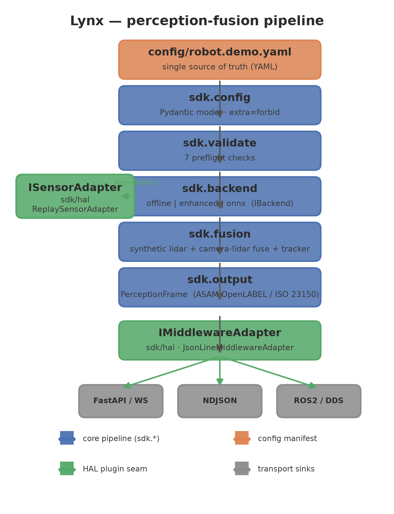
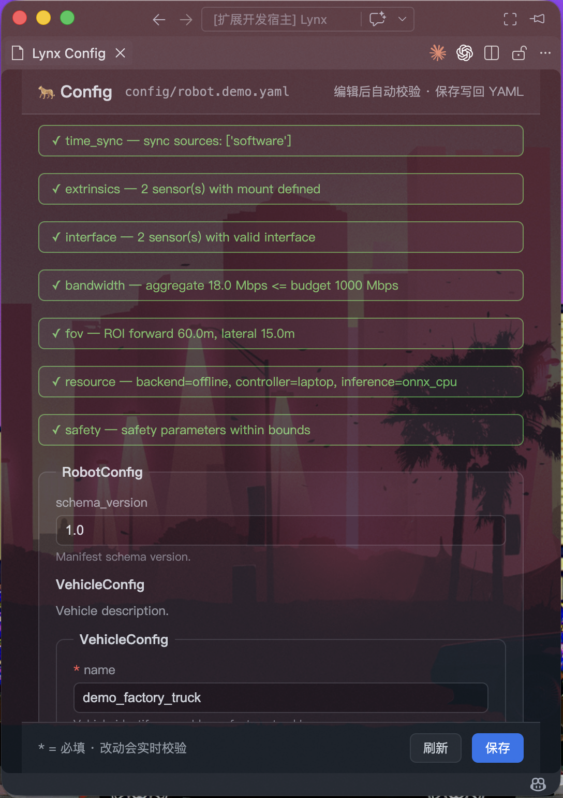
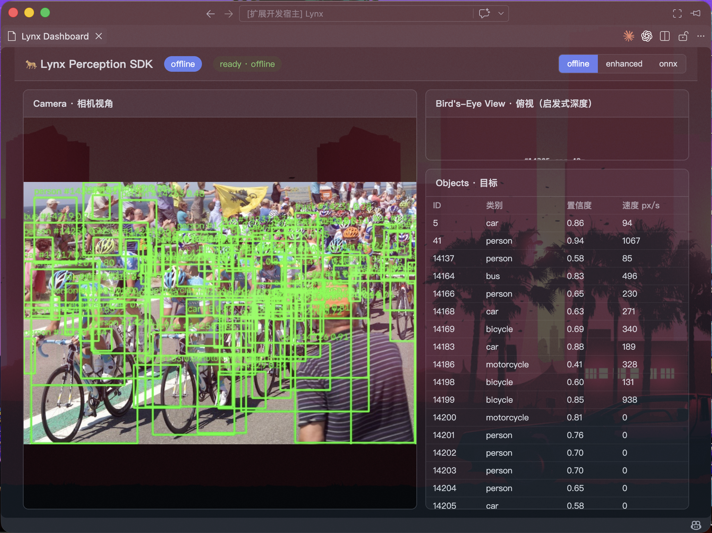
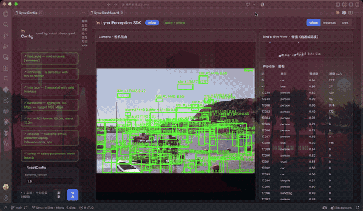

<h1 align="center">Lynx</h1>

<p align="center">
  <a href="LICENSE"></a>
  <a href="https://www.python.org/"></a>
  <a href="pyproject.toml"></a>
  <a href="https://docs.pydantic.dev/"></a>
</p>

<p align="center">
  <a href="README.md">English</a> | <a href="README.zh-CN.md">简体中文</a>
</p>

<p align="center">
  <em>面向封闭园区（厂区、港口、园区、校园）低速自动驾驶车辆的硬件无关感知融合 SDK。
  一套 SDK、三种推理后端、一种标准化输出。</em>
</p>

本仓库是 **行走骨架（walking skeleton）**：贯穿产品每一层的垂直切片，目标是打磨成
生产级 SDK，而不是在演示结束后被丢弃。

## 目录

- [概览](#概览)
- [特性](#特性)
- [架构](#架构)
- [仓库结构](#仓库结构)
- [快速开始](#快速开始)
- [配置](#配置)
- [数据模型](#数据模型)
- [后端](#后端)
- [硬件抽象层](#硬件抽象层)
- [验证门禁](#验证门禁)
- [演示服务器](#演示服务器)
- [VS Code 扩展](#vs-code-扩展)
- [开发](#开发)
- [许可证](#许可证)
- [文档](#文档)

## 概览

Lynx 在硬件无关的插件接口背后，把原始传感器帧转化为标准化的 `PerceptionFrame`
（检测并跟踪的目标 + 交通标志）。当更换传感器、域控制器或中间件传输层时，核心
流水线始终不变——只需新增一个适配器插件。

- 单个配置清单是**唯一事实源**；每一项产物（JSON Schema、校验报告、后端选择、
  输出帧）都由它生成或校验。
- 输出数据模型对齐 ASAM OpenLABEL / ISO 23150 约定。
- 部署安全由**预检门禁**（七项语义校验）强制保证。

## 特性

- **硬件无关 HAL** —— `ISensorAdapter`、`IInferenceBackend`、`IMiddlewareAdapter`
  三个插件接缝，并附带演示实现。
- **唯一事实源** —— 单个 Pydantic 模型（`sdk/config.py`）驱动 JSON Schema、配置表单、
  校验器和运行时行为。
- **预检验证门禁** —— 七项部署校验（时间同步、外参、接口契约、带宽、视场、资源、安全）。
- **三种推理后端** —— 离线（YOLO11s）、增强（YOLO11x + ROI 重推理）、ONNX Runtime
  （可插拔执行提供器）。
- **标准化输出** —— 含 `ObjectType` / `SignType` / `SourceMask` 枚举、派生字段、
  2D/3D 框、跟踪与交通标志的 `PerceptionFrame`。
- **相机到激光雷达后融合** —— 投影 3D 框与相机 2D 框之间的 IoU 关联。
- **进程内遥测** —— 时延百分位、吞吐、按来源计数。
- **FastAPI 演示服务器** 与 schema 驱动的 **VS Code 扩展**。

## 架构

<p align="center">
  
</p>

流水线两端都是插件接缝：

- `ISensorAdapter`（`sdk/hal/sensor.py`）把时间对齐的 `FrameBatch` 送入流水线。演示
  自带 `ReplaySensorAdapter`，它像真实相机驱动一样回放录制的帧。
- `IMiddlewareAdapter`（`sdk/hal/middleware.py`）把每个 `PerceptionFrame` 发布到任意
  传输层。演示自带 `JsonLineMiddlewareAdapter`（NDJSON）。

## 仓库结构

```
config/robot.demo.yaml     唯一事实源清单
sdk/                        SDK 本体（此处无 FastAPI 或 UI）
  config.py                schema + 加载器
  validate.py              部署预检（7 项）+ to_report()
  geometry.py              IoU / NMS / merge
  output/frame.py          PerceptionFrame 与产品数据模型
  backend/                 IBackend + offline + enhanced + onnx
  input/replay_reader.py   FrameBatch + 回放数据源
  hal/                     ISensorAdapter / IMiddlewareAdapter + 演示适配器
  fusion/                  tracker、相机-激光雷达后融合、合成激光雷达
  camera.py                针孔模型（3D <-> 2D 融合桥梁）
  metrics.py               进程内遥测
  pipeline.py              run()：config -> validate -> detect -> track -> fuse -> emit
server.py                  FastAPI + WebSocket 演示
dashboard/index.html       单页看板
vscode-extension/          VS Code 扩展（配置表单 + 看板）
scripts/                   run / smoke / benchmark / config_io / export_* / make_demo_data ...
docs/schema/               生成的 JSON Schema（config + PerceptionFrame）
docs/architecture.png      流水线架构图
docs/images/               截图（配置编辑器、看板、演示）
tests/                     契约 + 校验器测试
```

## 快速开始

需要 Python 3.11+（ML 后端建议 3.11/3.12）。

```bash
# 1. 虚拟环境
python3.12 -m venv .venv && source .venv/bin/activate

# 2. 核心依赖（数据模型 / 配置 / 校验 / 服务器）
pip install -r requirements.txt

# 3. ML 依赖（可选，用于推理）
pip install -r requirements-ml.txt

# 4. 演示帧（合成数据，无需相机）
python scripts/make_demo_data.py 240 data/frames

# 5. 运行
python scripts/run.py
# -> http://127.0.0.1:8000
```

无服务器、无 UI 的无头冒烟测试：

```bash
python scripts/smoke.py config/robot.demo.yaml 5          # 5 帧
python scripts/smoke.py config/robot.demo.yaml 5 --jsonl  # 发布 NDJSON
```

运行测试：

```bash
python -m pytest tests/
```

## 配置

`config/robot.demo.yaml` 是唯一手写的部署文件。其键与 `sdk/config.py` 一一对应，并且
是驱动编辑器智能提示与 VS Code 配置表单的 JSON Schema 的来源。

```yaml
vehicle:                    # 运动学模型 + 包络
  name: "demo_factory_truck"
  type: "ackermann"         # diff_drive | ackermann | skid_steer | omni
  max_speed_ms: 5.0
  wheelbase_m: 1.8
  track_width_m: 1.4
  dimensions: { l: 2.4, w: 1.3, h: 1.9 }

domain_controller:          # 车载算力目标
  vendor: "nvidia"
  model: "laptop"           # laptop | jetson_orin_nano | rk3588
  compute_tops: 0
  inference_backend: "onnx_cpu"
  os: "ubuntu_22.04"
  middleware: "custom"      # ros2_humble | ros2_iron | dds_rti | some_ip | custom

sensors:                    # 每个传感器一条
  - name: "front_cam"
    type: "camera"
    interface: "usb"        # gige | ethernet | can | usb
    topic: "cam/front"
    mount: { x: 0.0, y: 0.0, z: 1.4, roll: 0, pitch: 0, yaw: 0 }
    fps: 20
    sync_source: "software"

perception:
  backend: "offline"        # offline | enhanced | onnx
  conf: 0.4
  modules: [detection, tracking, traffic_sign]
  roi: { forward_m: 60, lateral_m: 15 }
  small_target_enhance: true

calibration:                # 契约字段，由 CalibStore 加载（后续里程碑）
  camera_intrinsics: null
  extrinsics: null
  lidar_camera_extrinsic: null
  time_offset_ms: {}

safety:                     # @ai-lock - 只读
  min_braking_distance_m: 1.0
  min_obstacle_height_m: 0.05
  max_detection_latency_ms: 100
  redundant_fov_required: true

data:                       # 演示的回放源
  frames_dir: "data/frames"
  index_path: "data/index.csv"
```

清单中的 AI 注解约定：

- `@ai-lock` 标记只读块（如 `safety`），工具不得静默重写。
- `@ai-extend` 标记可扩展的自定义属性。
- `@ai-telemetry` 标记进入遥测流的字段。

## 数据模型

产品契约是 `sdk/output/frame.py` 中的 `PerceptionFrame`，已导出为 JSON Schema
（`docs/schema/perception_frame.schema.json`）。

| 类型 | 说明 |
|---|---|
| `PerceptionFrame` | `stamp_ns`、`frame_id`、`seq`、`backend`、`objects`、`traffic_signs`、`latency_ms` |
| `Track` | `Detection` 外加 `track_id` 与三维 `velocity` |
| `TrafficSign` | `type`、`cls_name`、`text`、`bbox_2d/3d`、`confidence`、`stamp_ns` |
| `Detection` | `cls_id`、`cls_name`、`type`、`sub_type`、`bbox_2d/3d`、`confidence`、`source`、`occlusion_ratio`、`small_target_score`、`pose_covariance`、`attributes` |
| `BBox2D` / `BBox3D` | 图像平面 (x, y, w, h) 与世界/车体 (x, y, z, l, w, h, yaw) 框 |

枚举：

- `ObjectType` —— `pedestrian`、`bicycle`、`vehicle`、`truck`、`cone`、`barrier`、
  `traffic_sign`、`traffic_light`、`unknown`。
- `SignType` —— `stop`、`speed_limit`、`yield`、`no_entry`、`traffic_light`、`unknown`。
- `SourceMask`（`IntFlag`）—— `CAMERA=1`、`LIDAR=2`、`RADAR=4`；融合为按位或
  （如 `CAMERA | LIDAR = 3`）。`source_label()` 渲染人类可读标签。

派生字段由 Pydantic 校验器自动填充：`type` 由 `cls_name` 派生（如 `person` ->
`pedestrian`），`sub_type` 承载细粒度类别。`pose_covariance` 为 6x6 行主序列表
（未知时为空）；`attributes` 承载 `@ai-extend` 自定义数据。

## 后端

所有后端实现同一 `IBackend` 接口（`init`、`detect`、`info`、`release`），由
`perception.backend` 选择。

| 后端 | 模型 | 说明 |
|---|---|---|
| `offline` | YOLO11s | 单次全帧推理，对 CPU 友好。部署车队的默认项。 |
| `enhanced` | YOLO11x + YOLO11s ROI | 全帧推理 + 远距离带 ROI 重推理，用于小目标（`small_target_enhance`）。 |
| `onnx` | YOLO11s ONNX | ONNX Runtime，可插拔执行提供器（`domain_controller.inference_backend`）。 |

ONNX 后端是硬件无关路径：同一 `.onnx` 图在 CPU、CUDA、TensorRT、ARM ACL 或
CoreML 上运行，无需更改 SDK 代码路径。

## 硬件抽象层

`sdk/hal/` 定义了让 SDK 硬件无关的插件接缝。

- `ISensorAdapter` —— `init`、`start`、`stop`、`grab`、`health`。默认采用拉模式，
  使数据流保持确定性与可回放性。`ReplaySensorAdapter` 以与真实驱动相同的接口回放
  录制的帧。
- `IInferenceBackend` —— 推理接缝（别名为 `IBackend`）。暴露 `info()` 返回
  `BackendInfo`（名称、模型、设备、遥测）。
- `IMiddlewareAdapter` —— `init`、`publish`、`subscribe`、`stop`。屏蔽 ROS2 / DDS /
  SOME-IP / 私有总线之间的差异。`JsonLineMiddlewareAdapter` 每行发布一个 JSON 对象。

## 验证门禁

`sdk/validate.py` 在流水线启动前运行七项语义校验，顺序遵循技术架构文档。
`to_report()` 渲染 JSON 报告，`scripts/validate_json.py --out preflight_report.json`
将报告写入磁盘。

| 校验项 | 目的 |
|---|---|
| `time_sync` | 各传感器使用单一主时钟 |
| `extrinsics` | 每个传感器都声明 `mount` |
| `interface` | 传感器类型 -> 物理接口契约 |
| `bandwidth` | 各类型聚合数据速率 vs. 预算 |
| `fov` | ROI 非零；需要时冗余前向覆盖 |
| `resource` | 后端 vs. 控制器算力预算 |
| `safety` | 速度、时延与制动距离边界 |

## 演示服务器

`server.py` 暴露一个 FastAPI 应用，在守护线程中运行流水线并流式推送最新帧。

| 端点 | 说明 |
|---|---|
| `GET /` | 单页看板 |
| `WS /ws` | 流式推送 `{ frame, image }`（image 为 base64 JPEG） |
| `GET /api/state` | 后端 + 存活状态 |
| `GET /api/metrics` | 运行时遥测 |
| `POST /api/switch` | 运行时切换 `offline` / `enhanced` / `onnx` |

## VS Code 扩展

`vscode-extension/` 提供：

- **配置表单** —— schema 驱动的 webview 表单，用于编辑清单，带实时预检验证，`@ai-lock`
  区块以只读方式渲染。
- **看板** —— 用于后端实时切换与状态查看的 webview 面板。

### 截图

<p align="center">
  
  
</p>

<p align="center">
  
</p>

## 开发

```bash
python scripts/export_schema.py docs/schema    # 重新生成 JSON Schema
python scripts/validate_json.py config/robot.demo.yaml --out preflight_report.json
python scripts/config_io.py get config/robot.demo.yaml       # config -> JSON
python scripts/config_io.py set config/robot.demo.yaml       # JSON -> config（stdin）
python -m pytest tests/                                      # 18 个测试
```

SDK 可通过 `pip install -e .` 安装，含可选依赖 `.[ml]`、`.[server]`、`.[dev]`。
`pyproject.toml` 是唯一的打包源。提交信息遵循 Conventional Commits，并使用英文书写。

## 许可证

Apache-2.0。详见 [LICENSE](LICENSE)。

